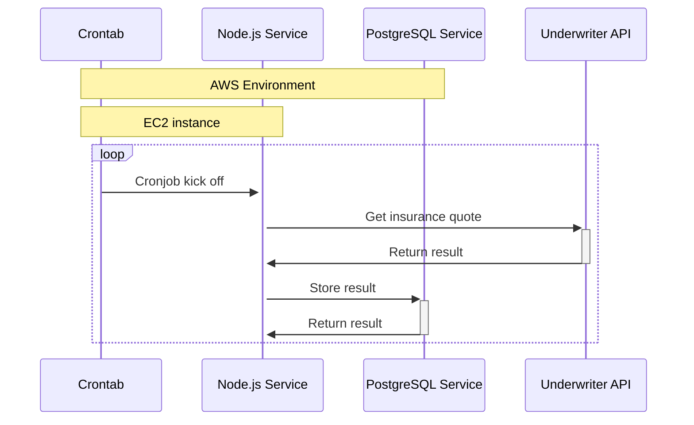
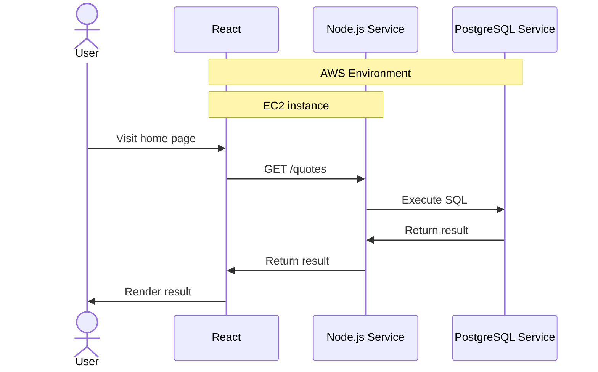

# Scenario

Your friend is the founder of InsuranceCo and have built a Node.js + PostgreSQL + React Single Page Application that
will display the prices of auto insurances between different underwriters, to track the prices between different
underwriters.

The Node.js backend API service will periodically (via a cronjob) hit auto insurance underwriter's APIs at midnight UTC
for a quote.

The service will get a quote and store it in the database. The flow looks like:

Once the results are stored in the database, the React Single Page Application will be able to load the results from the
database via a set of JSON API endpoints via the Node.js service.

The flow looks like:

Your friend has written the following terraform scripts, and they are not having much luck getting it to work in AWS.
Whereas it works perfectly locally on their development machine.

Task 1: Help your friend spot the problems in the terraform scripts under the `infrastructure` folder.

There are a number of errors, omissions, or misconfigurations in the Terraform files (more than 2, less than 10). In advance of the onsite interview, please spend some time with the code and document your findings by commenting inline in the Terraform file. As an example, if you find a naming issue on line 5, #leave a comment about the naming issue. We will talk through your discoveries in the Terraform file during the onsite.

Discuss the errors, omissions, or misconfigurations found in the take home Terraform files

Cloud Security measures for experience (Security, AWS, SRE, etc.)